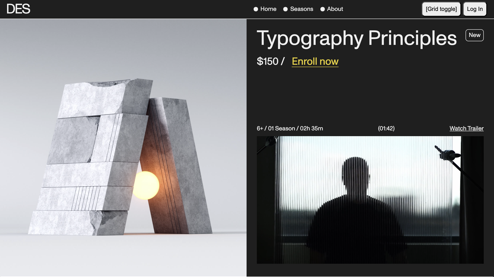

# ✅ What I’ve Accomplished

### 🧱 Core Technical Foundations

- Built a semantic, accessibility-aware HTML structure
- Thought in atomic design systems
- Connected Git + GitHub with real version control workflows
- Practiced proper commit messaging and branching
- Cloned and styled a pixel-perfect hero layout from a real Awwwards site

### 🖼️ Visual Execution

- Recreated a high-fidelity layout using CSS Grid + Flexbox
- Matched fonts, spacing, color, and hierarchy
- Solved real layout problems (scroll overflow, image sizing, object-fit)

### 🧠 Dev Habits Built

- Clean code organization
- Commenting and component thinking
- Accessibility from the beginning
- Developer-level GitHub repo

### ✅ Finished Hero Layout

### 🤔 What I struggled with

- Trying to resize the image so it would fit flush with the rest of the content and not overflow it/push it down the page further

### 💡 What I solved

- Debugging the page to realise that the image was the issue
